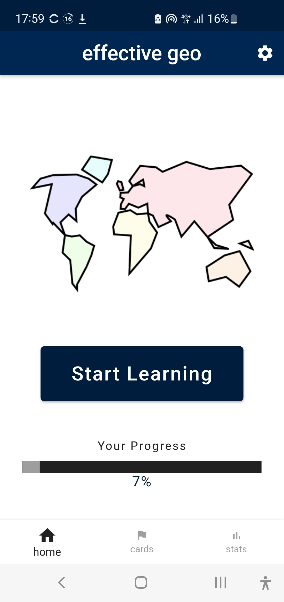
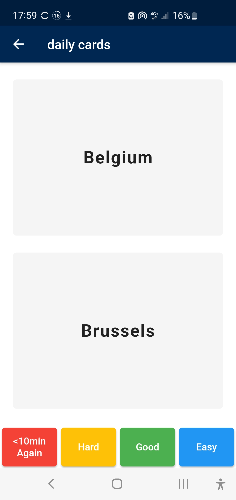
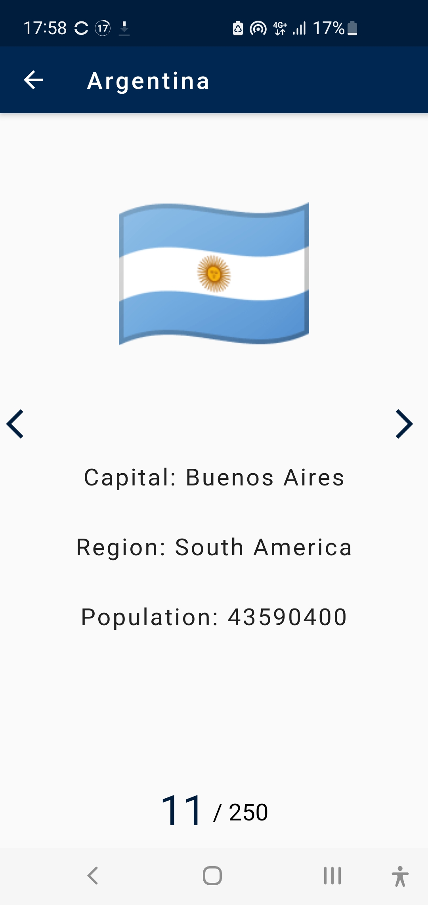

<div align="center">
  <h1>Effective Geo 🌍</h1>

  <p>
    <strong>Master World Capitals with Spaced Repetition</strong>
  </p>

  <p>
    <a href="https://flutter.dev/"></a>
    <a href="https://dart.dev/"></a>
    
    
  </p>
</div>

## 💡 About

**Effective Geo** is a geography learning application designed to maximize memory retention. Unlike simple quiz apps, it implements the **SuperMemo-2 (SM-2) algorithm** to schedule reviews based on the user's performance.

If you struggle to recall a capital, the app brings it back quickly. If you know it well, it schedules the next review weeks into the future. It features a comprehensive offline database of countries, flags, and population data.

---

## 📱 Screenshots

| Home & Progress | Flashcard Learning | Country Details |
|:-----------:|:----------------:|:----------------:|
|  |  |  |

---

## 🚀 Key Features

* **🧠 Spaced Repetition:** Uses the SM-2 algorithm to calculate the optimal interval for memory consolidation.
* **📊 Progress Tracking:** Visual charts using `fl_chart` to monitor mastery levels over time.
* **💾 Offline First:** Complete country database stored locally using **SQLite**.
* **🌗 Dark Mode:** Fully supported UI theming.
* **Quality Feedback:** 4-level rating system (Again, Hard, Good, Easy) directly influencing the scheduling algorithm.

---

## 🛠 Tech Stack

* **Framework:** Flutter & Dart
* **State Management:** `rxdart` (Reactive Streams)
* **Local Database:** `sqflite` (Raw SQLite interaction)
* **Dependency Injection:** `get_it`
* **Architecture:** Service-based architecture separating UI, Logic, and Data.

---

## 🧠 The Algorithm (SM-2)

The core logic revolves around the **SuperMemo-2** algorithm. Every card has dynamic properties stored in the SQLite database:

* **Interval (I):** Days until next review.
* **Repetition Factor (EF):** Easiness factor, adjusted based on user rating (0-3).
* **Repetitions (n):** Correct streaks.

```dart
// Simplified Logic
NextInterval = PreviousInterval * EasinessFactor
NewEasinessFactor = OldEF + (0.1 - (5 - Quality) * (0.08 + (5 - Quality) * 0.02))
```

This ensures that "hard" cards are shown frequently, while "easy" cards are pushed to long-term memory.

---

## 📥 Installation

1. **Clone the repo**
```bash
git clone https://github.com/libaum/effective_geo.git
```

2. **Install dependencies**
```bash
flutter pub get
```

3. **Run**
```bash
flutter run
```

---
